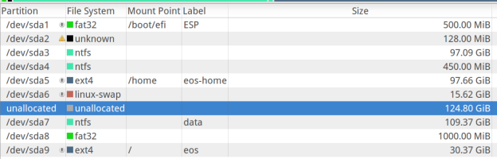
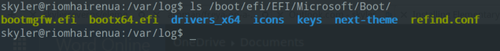

#Installing Elementary OS Freya

*Disclaimer: I provide no warranties. Backup and safely store your data/settings. This document was created from my
experience, but your experience might differ.*

*The Elementary OS team prefers not to abbreviate the name of the operating system to "eos". I found this out after
creating these steps, and to minimize errors in my documentation I will continue to use the abbreviation, but remember
this is not desired by the Elementary OS team.*

Also, thanks to [Avi Romanoff](http://github.com/aroman/freya-on-a-mac). His post got me moving in the correct direction.

## When should you use this guide?
1. You want to install Elementary OS using UEFI.
1. You repeatedly encounter an error message similiar to *"grub-efi-amd64-signed failed to install on /target/"* during the normal installation process.

## Expectations / Assumptions
You must be comforatable with disk partitioning, mounting drices, and your computer. I won't be going into detail about
commands, applications, or configuration outside the scope of this document.

## Before you get started
If you will be dual booting with Windows 8. It is my advice that you install Windows 8, and ensure the system is completely
up-to-date before starting the steps outlined in this document. If you intend to upgrade to Windows 8.1, do so before starting these steps
you cannot install Windows 8.1 when **secure boot** is turned off. Trust me, upgrade now and save time.

## What you need
1. A USB drive with a bootable version of Freya installed.
    1. [Freya 64-bit 20140810](http://downloads.sourceforge.net/project/elementaryos/unstable/elementaryos-unstable-amd64.20140810.iso)
    1. [Pen Drive Linix](http://www.pendrivelinux.com/universal-usb-installer-easy-as-1-2-3/)
1. A laptop that suppports UEFI and Elementary OS
1. [rEFInd](http://www.rodsbooks.com/refind/getting.html)

## Starting the installation process (Partitioning)
1. Disable Secure Boot in your BIOS
1. Insert the newly created bootable USB, and open the intercept boot menu (usually pressing f12 during boot)
1. Select the USB drive
1. "Try Elementary OS Without Installing"
1. Open up GParted and create an appropriate partitioning schema
    1. 1 partition for the OS
        1. filesystem: ext4
        1. label: eos
    1. 1 partition for the swap
        1. filesystem:linux-swap
    1. 1 partition for the home directory
        1. filesystem: ext4
        1. label: eos-home
    1. **DO NOT REMOVE YOUR ESP PARTITION**

## Run the installer
1. Open up terminal
1. Run the following command `ubiquity -b`. This will run the installer without installing GRUB
1. Follow the steps on the screen, but when asked about partitioning choose **Something Else...**
1. Specify the mount point for your OS partition (/)
1. Specify the mount point for your home partition (/home)
1. Double check your swap partition is identified as swap space
1. Finish the installation, **DO NOT RESTART**, continue testing Elementary OS

## Install rEFInd
1. Download and extract the rEFInd archive.
1. In terminal
    1. `sudo mkdir /boot/efi`
    1. `sudo mount /dev/sda1 /boot/efi` (This assumes your ESP partition is /dev/sda1)
    1. `sudo <path_to_rEFInd>/install.sh --alldrivers`

## Manipulating the EFI loader
*Note: Your computer manufactuere has probably "hard-coded" the EFI loader that will be used during boot.
So you might need to do a little playing, but on my Dell XPS15, the default is Microsoft.*

1. After installing rEFInd you will have folder called refind in /boot/efi
1. Back up the boot directory of your default loader
1. Replace the boot directory contents with the contents of the refind loader
1. Rename refind_x64.efi to the same name of the main efi peviously in the directory
    1. For example, if your default loader is Microsoft the default efi file is bootmgfw.efi

## Dual Booting Windows
1. Create a copy of the backed up boot loader (assuming it was windows).
1. At the top level of the EFI directory name this copy Windows
1. rEFInd will auto detect this, and allow you to continue booting into windows.

At this point you can reboot, remove the USB drive, and you have a dual boot system using UEFI. In part 2 I'll explain
cleaning up the menu and theming.
