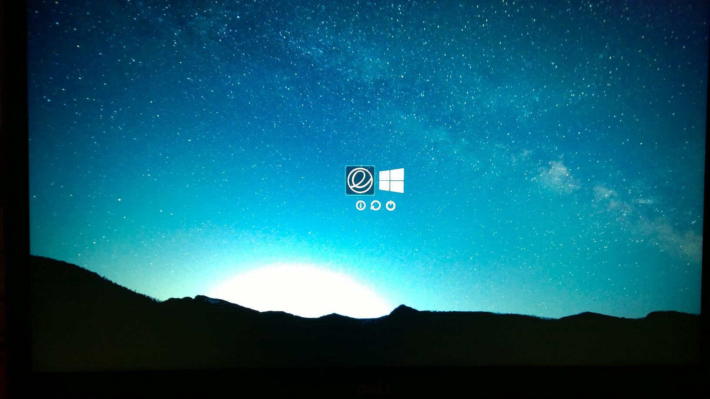

# Theming UEFI

*Disclaimer: I provide no warranties. Backup and safely store your data/settings. This document was created from my
experience, but your experience might differ.*

*The Elementary OS team prefers not to abbreviate the name of the operating system to "eos". I found this out after
creating these steps, and to minimize errors in my documentation I will continue to use the abbreviation, but remember
this is not desired by the Elementary OS team.*


## Expectations / Assumptions
You have completed [Part 1](./installing-elementary-os-freya.md) in its entirety. If you have not do so now. Keep the
bootable USB drive created in Part 1 handy. You will need it if things go wrong.

## Information Gathering
1. Boot to the rEFInd page.
1. For each operating system you want to maintain in the list do the following:
    1. Write down the subtext (it changes as you move through each option).
    1. Gather all the information about each operating system option.
    You may need to press f2 and see what additional options are being sent. to the loaders.

## Creating Custom Stanzas
1. Boot into Elementary OS
1. Create a file called custom-splash.conf in /boot/efi
1. Copy the contents of [custom-splash.conf](./packages/custom-splash.conf) into the new file
1. Update the options for the Elementary OS stanza. You can get your volume UUID by running `sudo blkid /dev/sdaX`
1. Update the path to the Elementary OS icon if needed, ignore the "next-theme" portion of the path for now.

## Theme rEFInd
1. Download [next-theme.tar.gz](./packages/next-theme.tar.gz)
1. Decompress next-theme.tar.gz into <efi-boot-loader>/next-theme
1. Update background config in <efi-boot-loader>/next-theme/theme.conf
    1. My native resolution is 3200x1800, change the file name to a resolution supported by your computer. (e.g. background_1800.png)

## Update the refind.conf
1. Lastly we need to update the refind.conf
    1. `sudo scratch-text-editor <efi-boot-loader>/refind.conf`
    1. Add at the end:

````
dont_scan_volumes eos, ESP

include /custom-splash.conf
include next-theme/theme.conf

````

If you used my resolution your boot screen will look like this:


## Troubleshooting
1. If your boot options do not work, this is okay.
1. Boot to your USB drive, follow the steps outlined in part 1 to mount the ESP drive.
1. Comment out the last three lines of refind.conf, update the settings as needed, try again.